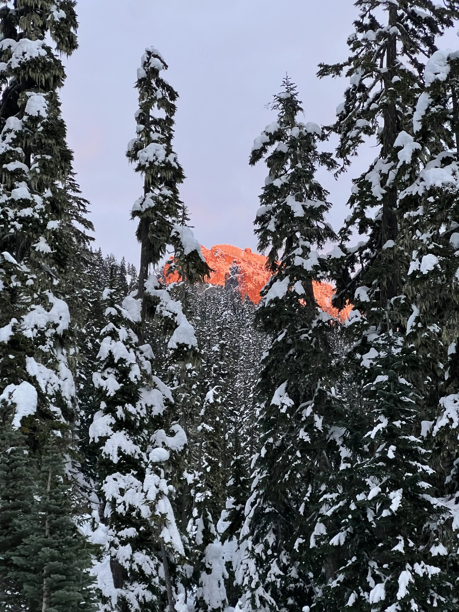

## Intro
Washington is a great place for outdoor recreation almost year-round. There’s deep snow to ski and ice to climb in the winter, epic spring skiing and mountaineering, summer alpine objectives, and crisp fall rock climbing. And then there’s the “muck” season.
The “muck” season is my term (adapted with love from my dad’s “mush” season—used to describe the period in spring when the winter snowpack transitions to springtime diurnal conditions) for the time, usually starting in October, when precipitation is frequent but not yet cold enough to produce snow for skiing. This combination leaves the rock wet, most hiking trails foggy or rainy for weeks, and if you are brave enough to venture into the alpine, it’s sure to dust your objective in snow and leave you questioning your life choices.

## Acidents in North American Climbing
Everyone deals with the muck season differently. I take a few light weeks to rest and recuperate after peak summer guiding season and spend more time with family and friends. It’s also the time of year when Accidents in North American Climbing (AINAC) comes out. 

Published annually by the American Alpine Club since 1948, AINAC compiles accident reports and analyses of the year’s most notable or significant climbing incidents. It’s a sobering read, and I recommend that anyone serious about climbing in the alpine make reading it part of their practice.
Although AINAC contains valuable reporting, the reader is forced to slog through many reports like the following excerpt from this year’s edition: 
On July 14th at 3:45p.m., NPS personnel received a cell phone call from two young climbers stuck on Teewinot (12,330 feet). The male climbers, aged 19 and 20 years, reported that they were on a snowfield North of the Idol and Worshipper rock formations. They were carrying ice axes but did not know how to use them. 
While no one (especially not me!) is immune to mistakes or being ill-prepared, reading several similar reports in a row can leave you wondering what lessons you are actually getting for your time spent reading. My intention with this blog post is to highlight three accidents from this year’s edition that I find particularly instructive. I chose these because:
1.	They all involved experienced climbers.
2.	They feature clear, digestible lessons that can benefit climbers simply by being aware of them.
3.	They occurred during rock or alpine rock climbing.
4.	No one died, though each accident was an uncomfortably close brush with death.
Let’s dive in.
